# Object Detection in an Urban Environment

## Data

For this project, we will be using data from the [Waymo Open dataset](https://waymo.com/open/).

[OPTIONAL] - The files can be downloaded directly from the website as tar files or from the [Google Cloud Bucket](https://console.cloud.google.com/storage/browser/waymo_open_dataset_v_1_2_0_individual_files/) as individual tf records. We have already provided the data required to finish this project in the workspace, so you don't need to download it separately.

## Structure

### Data

The data you will use for training, validation and testing is organized as follow:
```
/home/workspace/data/waymo
    - training_and_validation - contains 97 files to train and validate your models
    - train: contain the train data (empty to start)
    - val: contain the val data (empty to start)
    - test - contains 3 files to test your model and create inference videos
```

The `training_and_validation` folder contains file that have been downsampled: we have selected one every 10 frames from 10 fps videos. The `testing` folder contains frames from the 10 fps video without downsampling.

You will split this `training_and_validation` data into `train`, and `val` sets by completing and executing the `create_splits.py` file.

### Experiments
The experiments folder will be organized as follow:
```
experiments/
    - pretrained_model/
    - exporter_main_v2.py - to create an inference model
    - model_main_tf2.py - to launch training
    - reference/ - reference training with the unchanged config file
    - experiment0/ - create a new folder for each experiment you run
    - experiment1/ - create a new folder for each experiment you run
    - experiment2/ - create a new folder for each experiment you run
    - label_map.pbtxt
    ...
```

## Prerequisites

### Local Setup

For local setup if you have your own Nvidia GPU, you can use the provided Dockerfile and requirements in the [build directory](./build).

Follow [the README therein](./build/README.md) to create a docker container and install all prerequisites.

### Download and process the data

**Note:** ”If you are using the classroom workspace, we have already completed the steps in the section for you. You can find the downloaded and processed files within the `/home/workspace/data/preprocessed_data/` directory. Check this out then proceed to the **Exploratory Data Analysis** part.

The first goal of this project is to download the data from the Waymo's Google Cloud bucket to your local machine. For this project, we only need a subset of the data provided (for example, we do not need to use the Lidar data). Therefore, we are going to download and trim immediately each file. In `download_process.py`, you can view the `create_tf_example` function, which will perform this processing. This function takes the components of a Waymo Tf record and saves them in the Tf Object Detection api format. An example of such function is described [here](https://tensorflow-object-detection-api-tutorial.readthedocs.io/en/latest/training.html#create-tensorflow-records). We are already providing the `label_map.pbtxt` file.

You can run the script using the following command:
```
python download_process.py --data_dir {processed_file_location} --size {number of files you want to download}
```

You are downloading 100 files (unless you changed the `size` parameter) so be patient! Once the script is done, you can look inside your `data_dir` folder to see if the files have been downloaded and processed correctly.

### Classroom Workspace

In the classroom workspace, every library and package should already be installed in your environment. You will NOT need to make use of `gcloud` to download the images.

## Instructions

### Exploratory Data Analysis

You should use the data already present in `/home/workspace/data/waymo` directory to explore the dataset! This is the most important task of any machine learning project. To do so, open the `Exploratory Data Analysis` notebook. In this notebook, your first task will be to implement a `display_instances` function to display images and annotations using `matplotlib`. This should be very similar to the function you created during the course. Once you are done, feel free to spend more time exploring the data and report your findings. Report anything relevant about the dataset in the writeup.

Keep in mind that you should refer to this analysis to create the different spits (training, testing and validation).


### Create the training - validation splits
In the class, we talked about cross-validation and the importance of creating meaningful training and validation splits. For this project, you will have to create your own training and validation sets using the files located in `/home/workspace/data/waymo`. The `split` function in the `create_splits.py` file does the following:
* create three subfolders: `/home/workspace/data/train/`, `/home/workspace/data/val/`, and `/home/workspace/data/test/`
* split the tf records files between these three folders by symbolically linking the files from `/home/workspace/data/waymo/` to `/home/workspace/data/train/`, `/home/workspace/data/val/`, and `/home/workspace/data/test/`

Use the following command to run the script once your function is implemented:
```
python create_splits.py --data-dir /home/workspace/data
```

### Edit the config file

Now you are ready for training. As we explain during the course, the Tf Object Detection API relies on **config files**. The config that we will use for this project is `pipeline.config`, which is the config for a SSD Resnet 50 640x640 model. You can learn more about the Single Shot Detector [here](https://arxiv.org/pdf/1512.02325.pdf).

First, let's download the [pretrained model](http://download.tensorflow.org/models/object_detection/tf2/20200711/ssd_resnet50_v1_fpn_640x640_coco17_tpu-8.tar.gz) and move it to `/home/workspace/experiments/pretrained_model/`.

We need to edit the config files to change the location of the training and validation files, as well as the location of the label_map file, pretrained weights. We also need to adjust the batch size. To do so, run the following:
```
python edit_config.py --train_dir /home/workspace/data/train/ --eval_dir /home/workspace/data/val/ --batch_size 2 --checkpoint /home/workspace/experiments/pretrained_model/ssd_resnet50_v1_fpn_640x640_coco17_tpu-8/checkpoint/ckpt-0 --label_map /home/workspace/experiments/label_map.pbtxt
```
A new config file has been created, `pipeline_new.config`.

### Training

You will now launch your very first experiment with the Tensorflow object detection API. Move the `pipeline_new.config` to the `/home/workspace/experiments/reference` folder. Now launch the training process:
* a training process:
```
python experiments/model_main_tf2.py --model_dir=experiments/reference/ --pipeline_config_path=experiments/reference/pipeline_new.config
```
Once the training is finished, launch the evaluation process:
* an evaluation process:
```
python experiments/model_main_tf2.py --model_dir=experiments/reference/ --pipeline_config_path=experiments/reference/pipeline_new.config --checkpoint_dir=experiments/reference/
```

**Note**: Both processes will display some Tensorflow warnings, which can be ignored. You may have to kill the evaluation script manually using
`CTRL+C`.

To monitor the training, you can launch a tensorboard instance by running `python -m tensorboard.main --logdir experiments/reference/`. You will report your findings in the writeup.

### Improve the performances

Most likely, this initial experiment did not yield optimal results. However, you can make multiple changes to the config file to improve this model. One obvious change consists in improving the data augmentation strategy. The [`preprocessor.proto`](https://github.com/tensorflow/models/blob/master/research/object_detection/protos/preprocessor.proto) file contains the different data augmentation method available in the Tf Object Detection API. To help you visualize these augmentations, we are providing a notebook: `Explore augmentations.ipynb`. Using this notebook, try different data augmentation combinations and select the one you think is optimal for our dataset. Justify your choices in the writeup.

Keep in mind that the following are also available:
* experiment with the optimizer: type of optimizer, learning rate, scheduler etc
* experiment with the architecture. The Tf Object Detection API [model zoo](https://github.com/tensorflow/models/blob/master/research/object_detection/g3doc/tf2_detection_zoo.md) offers many architectures. Keep in mind that the `pipeline.config` file is unique for each architecture and you will have to edit it.

**Important:** If you are working on the workspace, your storage is limited. You may to delete the checkpoints files after each experiment. You should however keep the `tf.events` files located in the `train` and `eval` folder of your experiments. You can also keep the `saved_model` folder to create your videos.


### Creating an animation
#### Export the trained model
Modify the arguments of the following function to adjust it to your models:

```
python experiments/exporter_main_v2.py --input_type image_tensor --pipeline_config_path experiments/reference/pipeline_new.config --trained_checkpoint_dir experiments/reference/ --output_directory experiments/reference/exported/
```

This should create a new folder `experiments/reference/exported/saved_model`. You can read more about the Tensorflow SavedModel format [here](https://www.tensorflow.org/guide/saved_model).

Finally, you can create a video of your model's inferences for any tf record file. To do so, run the following command (modify it to your files):
```
python inference_video.py --labelmap_path label_map.pbtxt --model_path experiments/reference/exported/saved_model --tf_record_path /data/waymo/testing/segment-12200383401366682847_2552_140_2572_140_with_camera_labels.tfrecord --config_path experiments/reference/pipeline_new.config --output_path animation.gif
```

## Submission Template

### Project overview

Automated driving systems require a wide variety of sensors to be installed in the vehicle. The main sensors are cameras, LiDAR, and radar.
The roles of each sensor are as follows.
- Camera
    - To acquire data from outside the vehicle in the form of video images. By applying image analysis to the acquired data, the automatic driving system can identify oncoming vehicles, pedestrians, white lines, signs, etc.
- LiDAR
    - Uses optical technology to measure the distance to an object and the direction in which the object is located. The acquired data can be analyzed to determine the three-dimensional structure of the object.
- Millimeter wave radar
    - This sensor applies millimeter waves with a wavelength of approximately 1mm-1cm and can detect obstacles up to 100m-200m in front of and behind the vehicle.


In this project, data obtained from the camera will be used to implement an object detection algorithm.
The object detection algorithm will enable the automated driving system to recognize oncoming vehicles, pedestrians, white lines, etc. as mentioned above.


### Set up
You can build using the Dockerfile. (Go to the "build" directory to do this).  

#### Requirements
- NVIDIA GPU with the latest driver installed
- docker / nvidia-docker

#### Build
Please follow the steps below to build.  
1. Build the image  

```
docker build -t project-dev -f Dockerfile .
```

2. Create a container  

```
docker run --gpus all -v <PATH TO LOCAL PROJECT FOLDER>:/app/project/ --network=host -ti project-dev bash
```

#### Setup
Once the container has been created, gsutil must be installed in the container.   

```
curl https://sdk.cloud.google.com | bash
```  


After installation of gsutil is complete, perform auth.   
```
gcloud auth login
```  


### Dataset
#### Overview of the dataset
We will use WAYMO open dataset for this project, which is a dataset of images of urban environments containing annotated cyclists, pedestrians and vehicles. 
First, we see the overview of the dataset below using Exploratory Data Analysis.ipynb.

#### Weather conditions
We can see that the dataset contains various weather conditions. 
- Sunny  
  

- Cloudy  
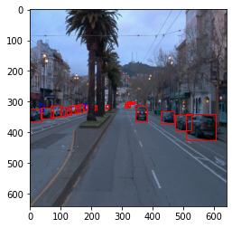  

- Rainy  
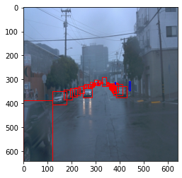  

- Foggy  
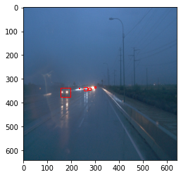   

- Snowy  
    - I didn't see snowfall conditions while checking the dataset. Therefore, probably there aren't or very few images of snowfall conditions.


#### Time
The dataset also includes images from both day and night time.  
- Day  


- Night  


  

#### Classes
As menthoned above, the dataset contains cyclists, pedestrians and vehicles classes. In the images above, cars are highlighted as red, pedestrians are blue, and cyclists are yellow.


***  


#### More in-depth analysis of the dataset
Next, we see more detailed analysis of the dataset by checking some distribustions obtained from the images.

#### Class Distribution of the bounding boxes
First, we see the class distribution diagram to check class imbalances. Below is the graph created in Exploratory Data Analysis.ipynb using 20000 random sampling from the dataset.


- We can see that the bounding box labels are mostly labeled as Car, and followed by Pedestrian labels.
- And there are very few bounding boxes labeled as Cyclist.
- The class imbalance may affect the training of the model. For example, since the number of images containing cyclist is considered very small, it will be difficult to recognize cyclists correctly.


#### Bounding box aspect ratios Distribution
Aspect ratios distribution may be important to configure the anchor box related parameters of the model. Below is the graph created in Exploratory Data Analysis.ipynb.

##### Aspect ratios distribution for all classes

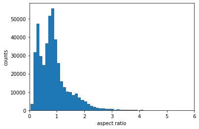

- We can see that most of the aspect ratios of the bounding boxes are in between 0-2.

##### Class-wise aspect ratio distribution

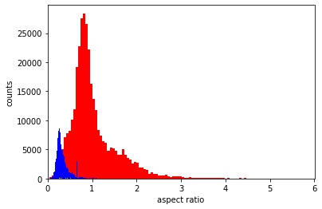

Red: Car, Blue: Pedestrian, Yellow: Cyclist


- We can see the difference in distribution and it seems that the aspect ratios of Cars are slightly larger than that of Pedestrian.
- This is probably because the shape of Car is landscape, and that of Pedestrian is portrait.


#### Bounding box sizes Distribution
The size of the bounding boxes may also affect configuring the anchor box parameters of the model. Also, class-wise distribution will be informative to analyze the data and configure the model.  

##### Box sizes distribution of all classes


- We can see the most of the sizes are < 10000.

##### Class-wise Box sizes distribution

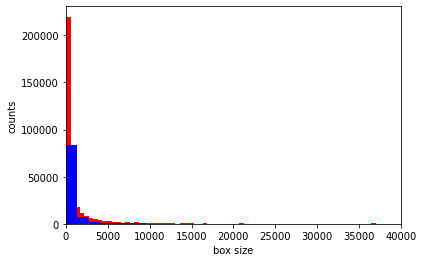

Red: Car, Blue: Pedestrian, Yellow: Cyclist  

- It seems that there is no significant difference in between the classes.

***


#### Cross validation
- The cross validation has already been done and the dataset was splited into train/eval/test.
- We will use train/eval dataset to train the model, and test dataset to test the model created.

### Training
#### Reference experiment
Below is the training results of the default model.

##### Loss  


- We can see that training is unstable.
- It would be due to batch size or optimizer.


##### Precision and Recall


- Training is unstable, so precision and recall are also low.
- In the following section, we try some changes in the config file and check improvements based on this result.

***

#### Improve on the reference
##### Batch size
By default, the training process seems to be unstable, so I only changed batch size to 5. 

##### Loss


- We can see the validation loss decreases with the train loss. 

##### Precision and Recall
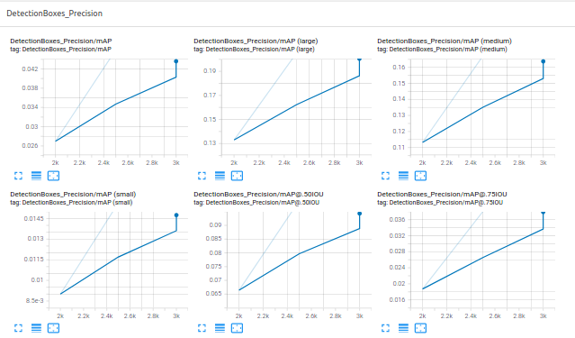
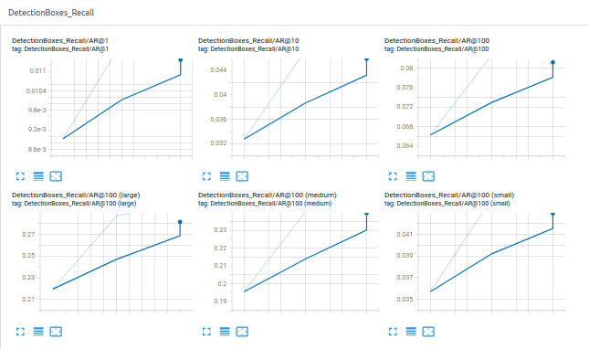

- We can see that precision and recall also improving with the training process.
- It seems that batch size stabilized the training process, in the next section, we discuss data augumentation.


##### Data Augumentation
- Based on EDA, we can see that there are various lighting conditions in the dataset. So first, I added brightness adjust augumentation to the config file to make the model robust to these conditions.

- Also I added black patches to config file, so combined with what was included by default, I used the following augumentations:
	- Random Horizontal flip
    - Random Crop
    - Random Adjust Brightness
    - Random Black Pathes
    
##### Loss

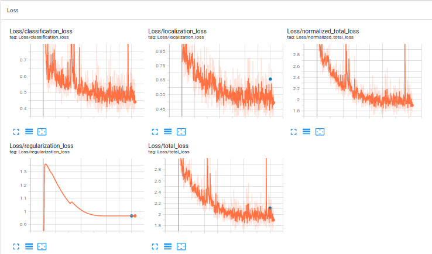

- We can see almost no changes in losses compared to the previous section.

##### Precision and Recall

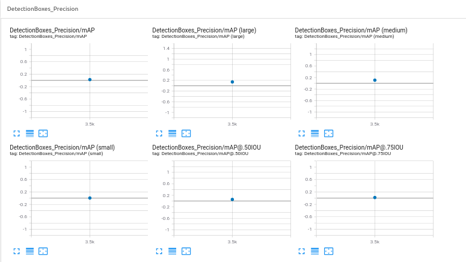
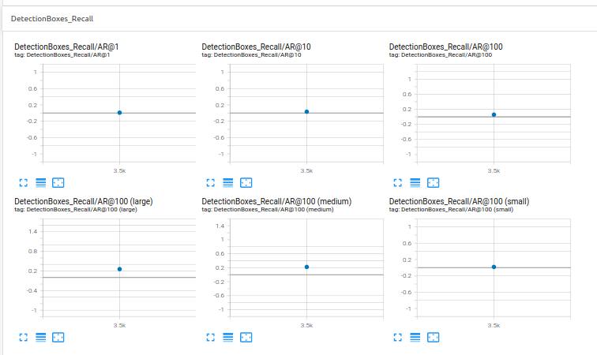


- For precision and recall, it seems no change or rather worse than the previous section.
- Therefore, I adapted the default augmentation (Random horizontal flip + Random crop) as augumentation.

##### Aspect ratio of bounding boxes  
In the EDA section, we saw that aspect ratio of almost all bounding boxes are in between 0-2. So I changed "multiscale_anchor_generator"  in config file to following:

```
multiscale_anchor_generator {
        min_level: 3
        max_level: 7
        anchor_scale: 4.0
        aspect_ratios: 1.0
        aspect_ratios: 1.5
        aspect_ratios: 0.5
        scales_per_octave: 2
      }
```

##### Loss
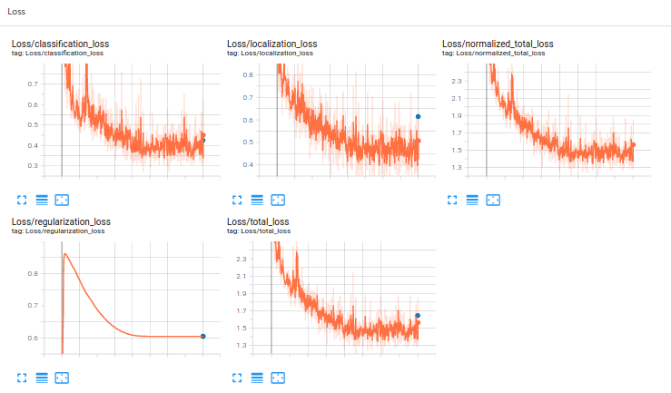

- There seems to little or no changes in Loss.

##### Precision and Recall

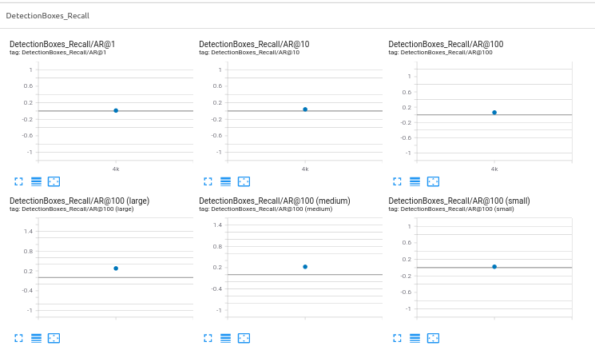

- In Precision and Recall also little or no difference.
- Maybe we need to set other parameter in anchor_generator such as ssd_anchor_generator.

***

### Concluison
- Increasing batch size stabilized the training process of the model.
- Data augumentation by brightness adjustment and black patches had no effect on the model performance.
- Adjustment of aspect ratio of anchor generator had little of no effect on the model performance.
